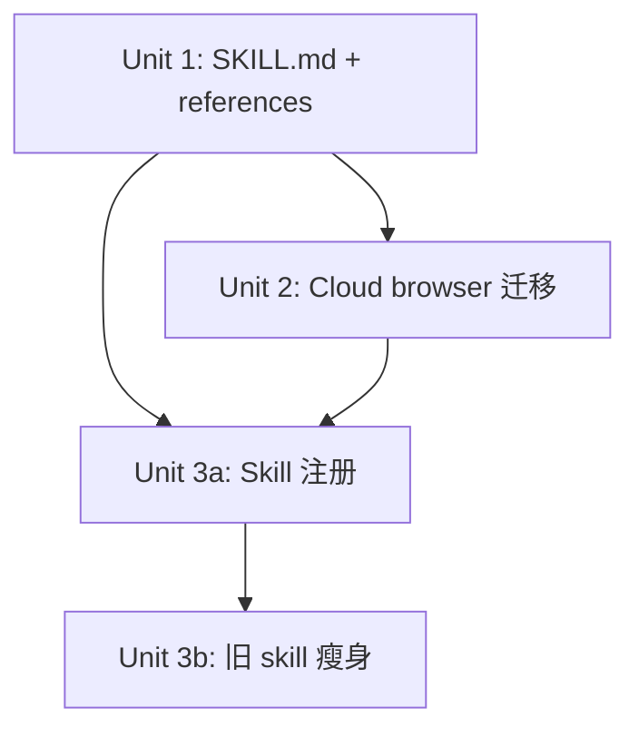

# refactor: 统一 content-access skill 整合 opencli 与 summarize

## Overview

新增统一 skill `content-access`，整合现有 `opencli` 和 `content-extract` 的全部应用场景。按用户意图路由：opencli 为平台内容一等 provider，非 opencli 平台走 `summarize --extract`，都失败则云浏览器托底。不自建任何提取脚本（trafilatura、readability-lxml、whisper 脚本等均不需要），统一输出格式规范由 AI agent 自行格式化。

**架构核心：路由逻辑由 AI agent 基于 SKILL.md 决策表直接执行，scripts/ 只放云浏览器脚本。**

## Problem Frame

当前 `opencli` 和 `content-extract` 两个 skill 存在职责重叠：
- content-extract 的 L1-Video 路径（yt-dlp + Whisper）与 opencli 的 `transcribe` 命令重复
- content-extract 以 `summarize` CLI 作为 L1 主路径，决策流程复杂（4 级降级链）
- 用户请求经常同时触发两个 skill，造成混乱
- 没有统一的输出格式，上层 workflow 需要适配不同 provider 的返回结构

**为什么不直接修改现有 content-extract？** content-extract 的架构围绕 summarize 五级降级链设计，整个决策流程需要重写并引入 opencli 作为一等 provider——这已超出修补范围，新建 skill 更干净。

## Requirements Trace

- R1. opencli 支持的平台/操作必须优先走 opencli
- R2. 非 opencli 平台走 summarize（`summarize --extract`）
- R3. 自己的音视频提取不做，都走 opencli（支持平台）或 summarize（本地文件），剔除重复流程
- R4. 不需要 trafilatura 和 readability-lxml
- R5. 都完成不了，采用云浏览器托底
- R6. 在 references/output-schema.md 定义统一输出格式规范，AI agent 自行格式化输出
- R7. CLI-first，兼容 OpenClaw 和 Claude Code（主路径一致，需要浏览器时直接走云端浏览器，不依赖 OpenClaw Browser）
- R8. SKILL.md 聚焦决策逻辑和路由规则（决策树、能力矩阵引用），详细参考数据放 references/，仅云浏览器自动化脚本（cloud_browser_*.py/sh）放 scripts/
- R9. action 类操作必须有二次确认和风险提示
- R10. 旧 skill frontmatter 修改后不与新 skill 冲突触发

## Scope Boundaries

- 不自建任何提取脚本（不用 trafilatura、readability-lxml、pypdf、whisper 脚本）
- 不做本地已有纯文本文件的读取（直接 Read）
- 不新增 opencli 适配器（沿用现有 55+ 命令）
- 不改动 opencli CLI 源码本身
- 不用 Python 脚本做意图分类或路由决策（AI agent 直接执行）
- 已知视频平台（douyin.com、v.qq.com 等域名清单内）的 URL 不做提取，直接报错；非清单内的未知 URL 走 summarize

## Context & Research

### Relevant Code and Patterns

- `~/.openclaw/skills/opencli/SKILL.md` — 383 行，含完整命令参考、适配器创建流程、输出格式规则
- `~/.openclaw/skills/opencli/references/commands.md` — 16 平台 55+ 命令的参数详情
- `~/.openclaw/skills/content-extract/SKILL.md` — 300 行，4 级降级决策流程（L1-L4），决策逻辑全部在 SKILL.md 中由 AI 执行
- `~/.openclaw/skills/content-extract/scripts/` — cloud_browser_extract.py, cloud_browser_session.sh, cloud_browser_stop.sh（仅 3 个脚本，全部是云浏览器自动化）
- Skill 目录标准结构：`SKILL.md` + `references/` + `scripts/`，frontmatter 含 `name` + `description`

### 已安装工具链

| 工具 | 版本/状态 | 用途 |
|------|----------|------|
| opencli | 1.5.7 | 平台内容 provider |
| summarize | ✅ | 网页/PDF/音频/视频内容提取 |
| playwright | 1.58.0 | 浏览器自动化（云端浏览器） |

### 不再需要安装

本方案不需要安装任何新依赖。trafilatura、readability-lxml 不再引入。summarize 已安装且覆盖所有非 opencli 的提取场景。

## Key Technical Decisions

- **路由由 AI agent 直接执行，不用 Python 脚本**：现有 content-extract 已证明 AI 读 300 行 SKILL.md 做决策流程完全可行。输入分类、路由决策、输出格式化都由 AI 基于 SKILL.md 中的决策表完成。scripts/ 只放云浏览器脚本。
- **非 opencli 平台统一用 summarize**：summarize 已安装，支持网页、PDF、音频、视频（本地文件），`summarize --extract --format md` 即可获取原始内容。无需自建 trafilatura/readability-lxml/pypdf/whisper 等提取器。
- **非 opencli 平台视频 URL 直接报错**：summarize 对非 YouTube 视频 URL 能力有限，yt-dlp 流程已由 opencli 覆盖支持平台。不支持的平台视频 URL 不做尝试，直接告知用户。SKILL.md 中需列出已知视频平台域名清单（douyin.com、v.qq.com、iqiyi.com、youku.com、xigua.com 等），非清单内 URL 一律走 summarize 而非报错。
- **微信文章直接走 cloud browser**：mp.weixin.qq.com 反爬严格，summarize 无法获取内容，直接走 cloud browser。
- **Cloud Browser 脚本迁移并适配输出**：content-extract 的 3 个 cloud browser 脚本复制到新 skill，cloud_browser_extract.py 的 `{title, body}` 输出需适配为统一格式（body→content）。继承旧 skill 的超时约束（session 600s 上限，poll 最多 3 次）。
- **不需要独立 web_fetch 降级层**：summarize 内部已包含 HTTP GET 抓取能力（firecrawl auto），因此 summarize 失败后直接升级到 cloud browser，无需中间层。
- **opencli 失败分类处理**：SKILL.md 决策表需包含 opencli 常见错误类型映射——"命令不存在/平台不支持"→降级 summarize，"登录态失效/Cookie 过期"→提示用户登录，"rate limit/网络超时"→重试或报错。
- **URL 标准化规则写入 SKILL.md**：YouTube shorts/live→watch、youtu.be→youtube.com/watch?v=、去 utm/si 参数、Twitter→x.com、m.bilibili.com→bilibili.com、mobile.twitter.com→x.com 等规则简单明确，AI 直接执行即可。
- **capability-matrix 标注 URL 提取默认命令**：每个平台标注"用户给 URL 要内容时"的默认 opencli 命令（如 YouTube URL→transcribe、Twitter URL→thread（取 tweet-id，需从 URL 末段提取）、Bilibili URL→transcribe），消除 AI 猜测空间。同时记录基准 opencli 版本号（1.5.7）。注：`twitter detail` 命令在 1.5.7 中不存在，应使用 `twitter thread <tweet-id>`，URL 标准化规则中需包含从完整 tweet URL 提取 tweet-id 的方法。

## Open Questions

### Resolved During Planning

- **Q: 为什么不用 trafilatura/readability-lxml？** → summarize 已覆盖网页提取场景，且已安装。引入额外 Python 库增加维护负担和依赖冲突风险，无实际收益。
- **Q: 本地音视频怎么处理？** → 走 summarize。`summarize "/path/to/file.mp3" --extract --format md --transcriber whisper --timeout 30m` 已内置 whisper 转录能力，不需要自建 extract_audio.py。
- **Q: 非 opencli 平台视频 URL 怎么处理？** → 直接报错。opencli 已覆盖 YouTube/Bilibili 等主流平台的 transcribe，其他平台视频不做支持。
- **Q: 为什么不用 Python 脚本做输入分类和路由？** → AI agent 本身就是最强的意图分类引擎。现有 content-extract 300 行 SKILL.md 由 AI 直接执行决策流程已证明可行。

- **Q: 为什么不需要独立 web_fetch 降级层？** → summarize 内部已包含 HTTP GET + firecrawl auto 降级，失败后直接走 cloud browser 即可。无需像旧 content-extract 那样在 summarize 和 browser 之间插入 web_fetch 层。
- **Q: TG 附件怎么处理？** → OpenClaw 下载后得到本地文件路径（消息的 file_path 字段），直接归入 local_file 分支处理。无需特殊路径。

### Deferred to Implementation

- **summarize 对特定类型文件的提取质量**：需实测确认 summarize 对 PDF、长音频等的提取效果
- **opencli youtube transcribe 的 cookies fallback 验证**：需确认在字幕不可用时是否有等效降级路径

## High-Level Technical Design

> *This illustrates the intended approach and is directional guidance for review, not implementation specification. The implementing agent should treat it as context, not code to reproduce.*

```
用户请求
  │
  ▼
AI agent 读 SKILL.md 决策表
  │
  ├─ structured 意图 (查B站热门/搜知乎/看时间线)
  │    └─ 直接执行 opencli <site> <command>
  │
  ├─ platform URL (youtube.com/bilibili.com/x.com/...)
  │    ├─ 查 capability-matrix → opencli 支持? → opencli（默认命令见 matrix）
  │    │    └─ opencli 失败 → 按错误类型：降级 summarize / 提示登录 / 报错
  │    └─ 不支持 → summarize --extract
  │         └─ 失败 → cloud browser
  │
  ├─ generic URL (博客/文档)
  │    └─ summarize --extract
  │         └─ 失败 → cloud browser
  │
  ├─ 微信文章 (mp.weixin.qq.com)
  │    └─ 直接 cloud browser
  │
  ├─ local_file（含 TG 附件下载后的本地路径）
  │    ├─ .pdf → summarize --extract
  │    ├─ .mp3/.wav/.m4a → summarize --extract --transcriber whisper
  │    ├─ .mp4/.mov → summarize --extract --transcriber whisper
  │    ├─ .txt/.md/.html → direct Read
  │    └─ summarize 失败 → 报错，建议用户手动处理
  │
  ├─ 已知视频平台 URL (非 opencli 支持)
  │    │  (douyin.com/v.qq.com/iqiyi.com/youku.com/xigua.com 等)
  │    └─ 报错：不支持该平台视频提取
  │
  └─ action (发推/回复/点赞)
       └─ 二次确认 → opencli <site> <action>

AI agent 按 output-schema.md 格式化输出
```

## Implementation Units



- [ ] **Unit 1: SKILL.md + references 文档**

**Goal:** 创建 content-access skill 的决策引擎：SKILL.md 路由决策表 + references 参考数据

**Requirements:** R1, R2, R3, R5, R6, R7, R8, R9

**Dependencies:** None

**Files:**
- Create: `SKILL.md`
- Create: `references/capability-matrix.md`
- Create: `references/output-schema.md`
- Create: `references/action-safety.md`

**Approach:**
- SKILL.md 包含：触发条件 frontmatter、完整路由决策树（structured/extract/action 三条链路）、URL 标准化规则（YouTube shorts/live→watch、youtu.be→youtube.com/watch?v=、去 utm/si、Twitter→x.com、m.bilibili.com→bilibili.com）、降级策略（summarize→cloud browser）、opencli 错误分类处理表、输出格式化指引、cloud browser 超时约束（600s 上限，poll 最多 3 次）
- capability-matrix.md 完整列出 16 个 opencli 支持平台 × 常见操作（hot/search/detail/transcript/thread/profile 等）的覆盖表，标注 opencli 命令与 fallback 选项，**为每个平台标注 URL 提取默认命令**（如 YouTube→transcribe、Twitter→detail）。记录基准 opencli 版本号（1.5.7）。该表自 commands.md 派生
- capability-matrix.md 增加"已知视频平台"域名清单列（douyin.com、v.qq.com、iqiyi.com、youku.com、xigua.com 等），用于 AI 判定"视频 URL → 报错"
- output-schema.md 定义统一输出格式规范：`{source_type, platform, title, url, path, author, published_at, content, transcript, metadata}`，标注各字段必填/可选状态，各 provider 的字段映射说明
- action-safety.md 定义写操作二次确认和风险提示流程
- frontmatter description 必须与旧 opencli / content-extract 的 description 不重叠
- 决策树中明确标注：已知视频平台 URL → 报错；微信文章 → 直接 cloud browser；TG 附件 → local_file 分支；本地文件 summarize 失败 → 报错建议手动处理

**Patterns to follow:**
- `~/.openclaw/skills/content-extract/SKILL.md` 的决策流程写法（300 行决策树由 AI 直接执行）
- `~/.openclaw/skills/opencli/SKILL.md` 的 frontmatter 格式
- `~/.openclaw/skills/himalaya/` 的 references 组织方式

**Test expectation: none — 纯文档/配置文件**

**Verification:**
- SKILL.md frontmatter 有效，description 明确触发条件
- SKILL.md 路由决策树覆盖 structured / extract / action 三条完整链路
- 决策树包含 opencli 错误分类处理表（降级/提示登录/报错）
- 决策树包含微信文章特殊路径（→直接 cloud browser）
- 决策树包含已知视频平台报错域名清单
- 决策树包含 TG 附件入口和本地文件失败处理
- capability-matrix.md 涵盖 16 个平台所有操作，标注 URL 提取默认命令
- output-schema.md 明确各字段必填/可选和各 provider 映射

---

- [ ] **Unit 2: Cloud Browser 脚本迁移**

**Goal:** 从 content-extract 迁移 cloud browser 脚本，适配输出格式

**Requirements:** R5, R7

**Dependencies:** Unit 1

**Files:**
- Create: `scripts/cloud_browser_extract.py` （从 content-extract 复制并修改输出格式）
- Create: `scripts/cloud_browser_session.sh` （直接复制）
- Create: `scripts/cloud_browser_stop.sh` （直接复制）

**Approach:**
- cloud_browser_session.sh 和 cloud_browser_stop.sh 复制后修改 timeout 为可选命令行参数（默认 120s），调用方按场景传参：普通页面 120s，微信长文/Reddit 评论树等复杂页面 180s
- cloud_browser_extract.py 修改输出：`{title, body}` → `{title, content, author, url}`（body 重命名为 content，补充 url 参数透传）
- 确认脚本无 summarize 隐式依赖

**Test scenarios:**
- Happy path: cloud browser 提取普通网页 → 输出包含 title + content
- Happy path: cloud browser 微信模式 → 输出包含 title + content + author
- Error path: CDP 连接失败 → 返回错误
- Integration: session create → extract → session stop 完整流程

**Verification:**
- 3 个脚本功能正常
- 输出格式与 output-schema.md 中 cloud_browser provider 映射一致
- 无 summarize 依赖残留

---

- [ ] **Unit 3a: Skill 注册**

**Goal:** 注册新 skill，使其可被 AI agent 发现和使用

**Requirements:** R7

**Dependencies:** Unit 1, Unit 2

**Files:**
- Create symlink: `~/.openclaw/skills/content-access` → `/home/ivan/projects/content-access`
- Create symlink: `~/.claude/skills/content-access` → `~/.openclaw/skills/content-access`

**Approach:**
符号链接通过 ~/.openclaw/skills/ 中转（与现有 skill 链接惯例一致）。注册后跑 Verification Checklist 验证主流程，确认新 skill 工作正常后再进入 Unit 3b。

**Test expectation: none — 文件系统操作**

**Verification:**
- `ls -la ~/.claude/skills/content-access/SKILL.md` 可访问
- Claude Code 能识别新 skill
- Verification Checklist 主要场景通过

---

- [ ] **Unit 3b: 旧 skill frontmatter 瘦身**

**Goal:** 修改旧 skill frontmatter 避免与 content-access 冲突触发

**Requirements:** R10

**Dependencies:** Unit 3a（新 skill 验证通过后）

**Files:**
- Modify: `~/.openclaw/skills/opencli/SKILL.md` — 修改 description
- Modify: `~/.openclaw/skills/content-extract/SKILL.md` — 修改 description

**Approach:**

opencli 新 description（收窄为 provider/扩展工具）：
```
Use opencli CLI tool directly. For low-level opencli commands, adapter development,
and site-specific CLI extension. NOT the primary entry for content browsing or extraction
— use content-access instead.
```

content-extract 新 description（退役标记）：
```
[DEPRECATED] Legacy content extraction. Use content-access skill instead.
Retained only for cloud browser scripts reference.
```

**注意**：content-extract 未在 Claude Code 的 ~/.claude/skills/ 中注册，frontmatter 修改主要影响 OpenClaw 环境。如果修改后出现问题，可直接 revert description 回退。

**Test scenarios:**
- Happy path: 用户说"查B站热门" → 只触发 content-access，不触发 opencli
- Happy path: 用户说"提取这个网页" → 只触发 content-access，不触发 content-extract
- Edge case: 用户说"创建 opencli 适配器" → 应触发 opencli（保留适配器开发能力）
- Edge case: 用户/workflow 显式说"用 opencli 命令" → 仍能触发 opencli
- **Negative test**: 用户说"提取这个 YouTube 视频" → 不同时触发 opencli 和 content-access

**Verification:**
- content-access 是内容操作的唯一入口
- opencli 只在明确提到 opencli 工具/适配器开发时触发
- content-extract 基本不再被触发

## System-Wide Impact

- **Interaction graph:** content-access 的 SKILL.md 指导 AI 调用 opencli CLI（bash）、summarize CLI（bash）、cloud_browser 脚本（playwright）。三个工具已安装，无新依赖。
- **Error propagation:** opencli 失败 → AI 根据错误类型决定是否降级到 summarize。summarize 失败 → AI 决定是否降级到 cloud browser。cloud browser 失败 → 报错给用户。非 opencli 平台视频 URL → 直接报错，不尝试提取。
- **State lifecycle risks:** Cloud browser session 必须在使用后释放（stop script）。无临时文件管理负担（不再有 yt-dlp/ffmpeg 临时文件）。
- **API surface parity:** 主路径一致（AI 读 SKILL.md → 调 opencli/summarize/cloud browser）。不依赖 OpenClaw Browser，需要浏览器时统一走 cloud browser。
- **Unchanged invariants:** opencli CLI 本身不做任何修改。现有 opencli 适配器开发流程不受影响。summarize CLI 本身不做任何修改。

## Risks & Dependencies

| Risk | Mitigation |
|------|------------|
| summarize 对某些页面/文件提取质量差 | cloud browser 托底；实测后调整决策树中的直接 cloud browser 路径 |
| 旧 skill 修改 description 后破坏现有 workflow | 新 skill 先上线验证，再修改旧 skill；保留回退能力 |
| opencli CLI 命令参数变化 | capability-matrix.md 集中维护，更新一处即可 |
| cloud browser API 不可用或配额耗尽 | SKILL.md 中标注 cloud browser 为最后兜底，不可用时直接报错 |
| opencli transcribe 的 cookies fallback 未验证 | Deferred to implementation：实测 opencli youtube transcribe 在字幕不可用时的行为 |

## Verification Checklist

### Structured
1. 查 B 站热门 → opencli bilibili hot
2. 搜知乎 "AI Agent" → opencli zhihu search
3. 查 X 某用户 timeline → opencli twitter timeline
4. 查 Reddit 热帖 → opencli reddit hot
5. 查 HackerNews top → opencli hackernews top

### Extract（opencli 支持平台）
6. 提取 YouTube transcript → opencli youtube transcribe
7. 提取 B站视频 transcript → opencli bilibili transcribe
8. 提取 X 单条推文 → opencli twitter thread <tweet-id>（从 tweet URL 提取 id）

### Extract（非 opencli 平台 → summarize）
9. 提取普通网页正文 → summarize --extract
10. 提取 PDF 正文 → summarize --extract
11. 提取本地音频转文字 → summarize --extract --transcriber whisper
12. 提取本地视频转文字 → summarize --extract --transcriber whisper

### Extract（特殊路径）
13. 提取本地 txt/md/html → direct Read
14. 提取微信文章 → 直接 cloud browser
15. 非 opencli 视频平台 URL（如 douyin.com）→ 报错
16. TG 附件 → 下载后走 local_file 分支

### Action
17. 发推文 → opencli twitter post（确认流程）
18. 回复/点赞/收藏 → 验证安全提示与确认流程

### 降级与错误处理
19. opencli 命令失败（登录态过期）→ 提示用户登录
20. opencli 命令失败（平台不支持）→ 降级 summarize
21. summarize 提取网页失败 → 降级 cloud browser
22. 本地文件 summarize 失败 → 报错建议手动处理

### 兼容性
23. OpenClaw 下验证主流程
24. Claude Code 下验证主流程
25. 验证无 trafilatura/readability-lxml 依赖
26. 验证无自建提取脚本依赖

### 冲突触发（负面测试）
27. 用户说"提取这个 YouTube 视频" → 不同时触发 opencli 和 content-access
28. 用户说"帮我看这个网页" → 不触发 content-extract

## Sources & References

- Existing opencli skill: `~/.openclaw/skills/opencli/`
- Existing content-extract skill: `~/.openclaw/skills/content-extract/`
- opencli commands reference: `~/.openclaw/skills/opencli/references/commands.md`
- summarize CLI: `~/.local/bin/summarize` (https://github.com/steipete/summarize)
